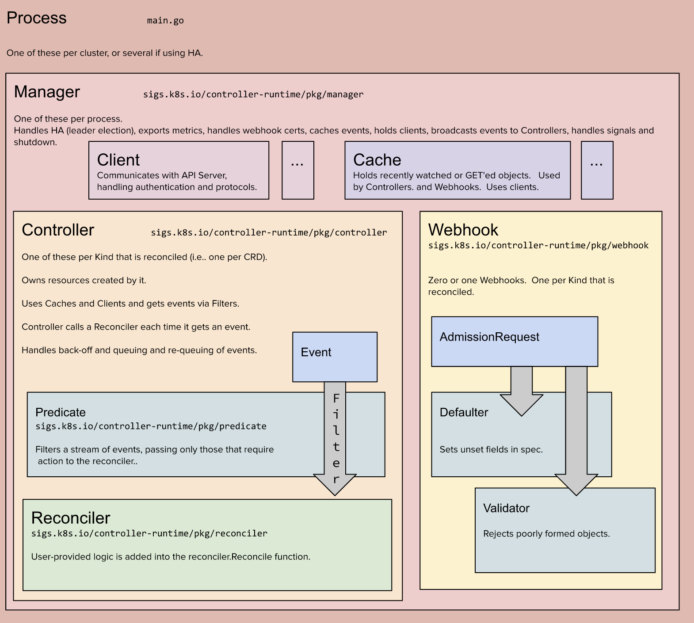

# kubernetes-controller-demo
testing out kubernetes controllers

## What is a kubernetes controller?
A kubernetes controller is usually a deployment that looks at a set of CRDs (custom resource definition), which represents some desired state, an acts by making requests to the kubernetes API or some other external API (cloud providers) in an attempt to bring the current state closer to the desired state.

Some examples are:

1. Job Controller - `Job` is the CRD holding the desired state, the controller looks for `Job`s and creates `Pod`s to fulfil the desired state.
2. Horizontal Pod Autoscaler Controller - `HorizontalPodAutoscaler` is the CRD, and the controller adjusts the `replicas` metric of a deployment to fulfil the specifications of the CRD based on the current state of the cluster.

## controller-runtime
Most controllers are written using high level constructs defined in the `sigs.k8s.io/controller-runtime` package.

The most basic constructs are:

### Managers:
Every controller is run by a controller manager, which is responsible for injecting common dependencies such as shared caches and clients, as well as managing leader election and graceful termination handlers.

Managers can also be used for running admission webhooks.

### Controllers:
Controllers handle events to trigger reconcile requests. The events may be filtered by using Predicates.

### Reconcilers
A reconciler implements a function that takes a reconcile request containing the name and namespace of the object to reconcile, reconciles the object and returns a response or an error indicating whether a second reconcile request should be requeued.

### Clients and Caches
Reconcilers use Clients to access API objects. The default client reads from a shared cache and writes directly to the API server. The cache auto-updates by watching specific object events and updating the object in cache when an event occurs. It is also possible to create a cache index to speed lookup times by a specific field.

### Schemes
Every resource in kubernetes has a `Group`, `Version` and `Kind`. The group is a collection of related functionality. A group may have different versions to allow changes to the API without breaking existing functionality. Every group may contain multiple `Kind`s that correspond to a single resource.

When refering to a specific API type we usually call it a GroupVersionKind or GVK, in our case, each GVK is represented as a Go type.

A `Scheme` is way to track which GVK corresponds to which Go type.

You create a new scheme for your GVK like this:
```golang
var	SchemeBuilder = &scheme.Builder{GroupVersion: GroupVersion}
```

Then register your custom go types:
```golang
func init() {
	SchemeBuilder.Register(&Cat{}, &CatList{})
}
```

## Architecture

*taken from: https://book.kubebuilder.io/architecture.html

## Writing a new controller
There are several ways of writing new kubernetes controllers. Because this is a task which includes a lot of boilerplate code and configuration, most of the times you would use one of the existing generation tools.

We will use [kubebuilder](https://book.kubebuilder.io/introduction.html) to generate the controller and CRDs.

1. Generating a new project:
```
kubebuilder init --domain example.cats.io
```

2. Adding a new CRD:
```
kubebuilder create api --group example.cats.io --version v1alpha1 --kind Cat
```

3. Add some fields to the Cat CRD:
```golang
// CatSpec defines the desired state of Cat
type CatSpec struct {

	// Most primitive go types may be used with the exception of numbers (only int32, int64 for integers, and resource.Quantity, for decimals)
	// When an primitive type is optional you should probably make it of pointer type to distinguish zero value and nil.

	// +kubebuilder:validation:Minimum=0
	// +optional

	// TotalLives is the total number of times a cat pod will be created.
	// Default is: 9
	TotalLives *int32 `json:"totalLives,omitempty"`

	// +kubebuilder:validation:MaxLength=128
	// +optional

	// Message is what the cat would say. Default is "hello, world!"
	Message *string `json:"message,omitempty"`

	// +optional

	// Duration the total duration per life. Default is 5s
	Duration *DurationString `json:"duration,omitempty"`
}

// CatStatus defines the observed state of Cat
type CatStatus struct {
	// LastCatPodName is the name of the last pod that was created by this cat
	LastCatPodName string `json:"lastCatPodName,omitempty"`

	// LastCatPodFinishedTime the time the last cat pod completed
	LastCatPodFinishedTime metav1.Time `json:"lastCatPodFinishedTime,omitempty"`

	// Phase the current phase of the cat
	Phase CatPhase `json:"phase,omitempty"`

	// Message is a description of the current phase
	Message string `json:"message,omitempty"`
}
```

4. Implement the reconciliation logic:
